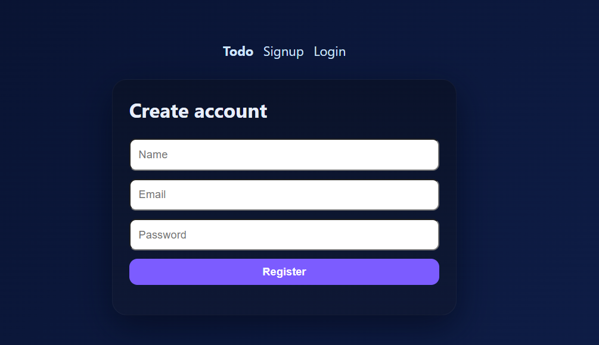
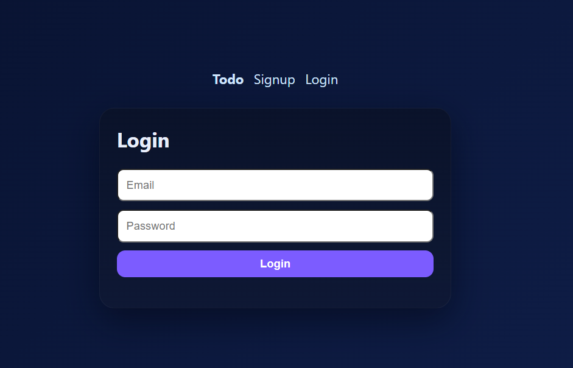
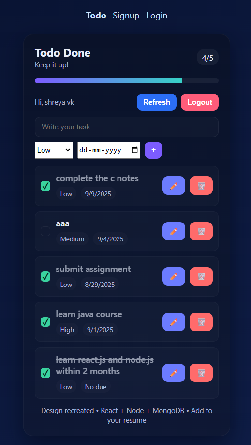

# ✅ Task Management Web App (MERN Stack)

A full-stack **Task Management Web App** built with the **MERN stack (MongoDB, Express, React, Node.js)**.  
Includes **JWT authentication**, **task prioritization**, **due dates**, and a **modern dark-themed UI**.  

---

## ✨ Features
- 🔑 User authentication (Register/Login) with **JWT**
- ✅ Add, edit, delete, and mark tasks as complete
- ⏳ Due date tracking
- 📌 Task priority levels (**Low, Medium, High**)
- 🎨 Dark-themed responsive UI
- 🔐 User-specific tasks (data isolation)
- 🚀 REST API with Express + Mongoose

---

## 🛠️ Tech Stack
**Frontend:** React, Axios, React Router  
**Backend:** Node.js, Express.js, JWT, bcryptjs  
**Database:** MongoDB (Mongoose ODM)  
**Other:** dotenv, CORS  

---

## ⚙️ Installation & Setup

## 1. Clone the repository
git clone https://github.com/yourusername/todo-app.git
cd todo-app

## 2. Backend Setup
cd backend
npm install

## Create a .env file inside backend/
PORT=5000
MONGO_URI=your_mongo_connection_string
JWT_SECRET=your_secret_key
JWT_EXPIRES=7d

## Run backend
npm start
## → Runs on http://localhost:5000 

## 3. Frontend Setup
cd ../frontend
npm install
npm start

---

## 📸 Screenshots

### 🔐 Signup Page  
  
### 🔐 Login Page  
  
### 🏠 Dashboard 


---

## 🚀 Deployment
- **Backend** → Render / Heroku / Vercel  
- **Frontend** → Netlify / Vercel  

👉 Update `frontend/src/api.js` with your deployed backend URL:
```javascript
const api = axios.create({
  baseURL: "https://your-backend-url.com/api",
});

---

## 📂 Project Structure
```plaintext
todo-app/
│── backend/          # Express + MongoDB API
│   ├── models/       # User & Task schemas
│   ├── routes/       # Auth & Task routes
│   ├── middleware/   # JWT protection
│   ├── utils/        # Token generator
│   └── server.js
│
│── frontend/         # React client
│   ├── src/
│   │   ├── App.js
│   │   ├── Todo.js
│   │   ├── Login.js
│   │   ├── Signup.js
│   │   └── api.js
│   └── index.css
│
└── README.md
---

## 📄 License
This project is licensed under the **MIT License** – see the [LICENSE](LICENSE) file for details.
